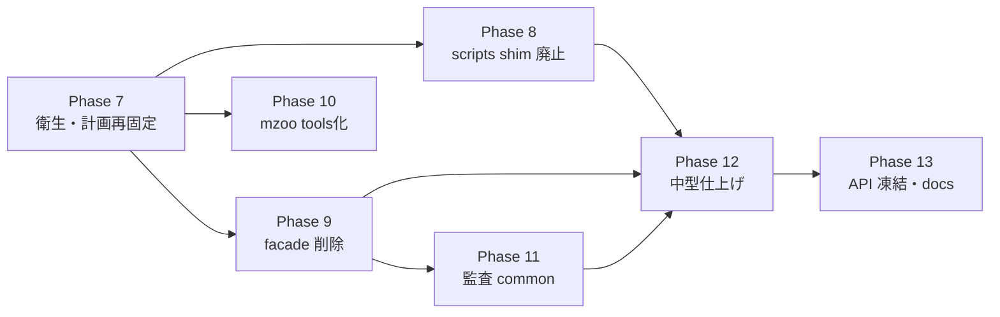

# RF-DETR フォーク — 完全リファクタリング計画（実測ベース改訂版）

ER-FlowScan モノレポ内 `rf-detr` フォーク向けの、**長年蓄積した無駄（移行残骸・facade・shim・中型ファイル）を段階的に除去する** ための実行計画です。

**重要（2026-06-28 全面改訂）**: 旧計画（Phase 13–20 体系）は **陳腐化したため破棄** しました。理由は2つ:

1. 旧計画が想定した God ファイル群（`detr.py` 分割、`pipeline.py` スリム化、tracking 分割、GUI 分解）は **すべて完了済み**。最大ファイルは現在 `media/tracking_audit.py` の 475 行。
2. upstream v1.8.1 マージ（`cad5f295`）後、git は `Phase 4/5/6` 番号で再起動した（`7142daf2 restore Phase 4 WIP after upstream merge`）。本計画は **git に合わせて Phase 7 から継続** する。

今の主敵は「巨大ファイル分割」ではなく、**前回の分割が残した移行残骸（facade / shim / 不完全な移行）の刈り取りと、最後の中型ファイル仕上げ** です。

**関連**: [refactor-boundaries.md](refactor-boundaries.md), [refactor-baseline-metrics.md](refactor-baseline-metrics.md), [refactor-debt-register.md](refactor-debt-register.md)

---

## 1. エグゼクティブサマリー

| 項目 | 内容 |
|------|------|
| 目的 | デモ層（`rfdetr_demo`）から移行残骸を除去し、upstream マージコストを最小化 |
| 方針 | **upstream (`src/rfdetr`) は触らない**。フォーク固有ロジックは **`rfdetr_demo` に集約** |
| 期間目安 | 7 フェーズ（Phase 7–13）≒ **3〜4 週間**（一部並行可） |
| 成功指標 | facade 0、shim 0、`scripts/` ロジック 0、400 行超 0、監査スキーマ 1 種、`tests/rfdetr_demo` ≥60 |

---

## 2. 原則（変更してよい／してはいけない）

| 原則 | 内容 |
|------|------|
| **ゾーン境界** | [refactor-boundaries.md](refactor-boundaries.md) を厳守 |
| **番号は git に合わせる** | 本計画は Phase 7 から。旧 doc の 13–20 体系は無効 |
| **1 PR = 1 サブフェーズ** | revert 可能な単位でマージ |
| **挙動優先** | リファクタ PR ごとに `mn1-2.mov` 短尺試走 or 監査スクリプトで回帰確認 |
| **新規ロジック禁止場所** | `scripts/` へのビジネスロジック追加禁止（AGENTS.md） |
| **facade は「利用ゼロ→即削除」** | 1 リリース猶予の口実で残さない。利用があるなら移行を完了させる |
| **upstream 同期** | `src/rfdetr/` は型・docstring・セキュリティパッチのみ |
| **機密** | 動画・監査は `confidential/` + `media_guard` 経由のみ |

---

## 3. 現状の負債インベントリ（2026-06-28 実測）

### 3.1 規模

| ゾーン | ファイル数 | 400行超 | 備考 |
|--------|-----------|---------|------|
| `src/rfdetr_demo/` | 85 | **1**（475） | 300行超は 11 件 |
| `scripts/` | 21 | 1（518） | うち ~15 が 3行 shim |
| `tests/rfdetr_demo/` | 24 | — | テスト件数の拡充余地 |

### 3.2 残存する無駄（カテゴリ別）

| ID | カテゴリ | 実体 | 規模 |
|----|---------|------|------|
| **A** | scripts shim | （Phase 8 で 19 本削除済; mzoo / animation tooling は別 Phase） | 0（shim） |
| **B** | demo facade | （Phase 9 で 6 本すべて削除済） | 0 |
| **C** | 不完全な移行 | （Phase 9 で解消） | 解消済 |
| **D** | scripts ロジック | `scripts/run_mzoo_benchmark.py` 518 行（AGENTS.md 違反） | 1 |
| **E** | 中型ファイル | 下表 11 件（300–475 行） | 11 |
| **F** | 監査2系統 | `frame_audit.py` + `tracking_audit.py` に JSONL/評価/画像 I/O 重複 | 重複 |
| **G** | CRLF チャーン | `.gitattributes` 変更で 91 ファイル modified 表示・実差分は 8 ファイル | 衛生 |
| **H** | 計画文書不整合 | 旧 doc=Phase 13–20、git=Phase 4–6（本改訂で解消） | doc |

### 3.3 中型ファイル（E — 300 行超）

| パス | 行数 | 分割方針 |
|------|------|---------|
| `media/tracking_audit.py` | 475 | Phase 11 で `audit/common` 抽出 |
| `vast/safety.py` | 417 | `consent` / `transfer_log` / `guardrails` |
| `inference/runner.py` | 355 | callback 組立を `callbacks` へ |
| `tracking/track_store.py` | 354 | hold/ghost 状態機械を分離 |
| `gui/panels/io_task.py` | 348 | `io_task_sections.py` 移譲を進める |
| `gui/panels/compute.py` | 346 | view と `VastController` 境界再点検 |
| `gui/panels/job_runner.py` | 327 | 進捗/ログを `RunController` へ |
| `gui/controllers/vast_controller.py` | 326 | offer 探索 / progress 分離 |
| `tuning/analyze_clip.py` | 319 | コアのみ残す（CLI は委譲済み） |
| `media/frame_audit.py` | 306 | Phase 11 の `common` 抽出で縮む |
| `inference/temporal_filter.py` | 301 | 設定 dataclass を `types` へ |

---

## 4. フェーズ一覧（ロードマップ）



並行可能: `7 →(8,9,10)→ (11)→ 12 → 13`。クリティカルパスは **9 → 12**。

| Phase | 名称 | 工数 | リスク |
|-------|------|------|--------|
| **7** | リポジトリ衛生・計画再固定 | 0.5 日 | 低 |
| **8** | `scripts/` shim sunset | 2 日 | 低 |
| **9** | demo 内 facade 削除（最重要） | 3 日 | 中 |
| **10** | `run_mzoo_benchmark` tools 化 | 2 日 | 低 |
| **11** | 監査2系統の `common` 抽出 | 3 日 | 中 |
| **12** | 残り中型ファイル仕上げ | 1 週 | 中 |
| **13** | 公開 API 凍結・ドキュメント統一 | 2 日 | 低 |

---

## 5. Phase 7 — リポジトリ衛生・計画再固定

### 目的
以降の diff を読めるようにし、計画と実態を一致させる。

### タスク
1. **CRLF 正規化を1コミットに隔離** — `.gitattributes` 起因の churn（91→実8）を `git add --renormalize .` で分離。機能 PR から行末ノイズを排除。
2. **未追跡生成物の確認** — `confidential/` `artifacts/` `sample/` `data/` は `.gitignore` 済み（OK）。`tests/rfdetr_demo/test_expected_person_count.py`（未追跡）のコミット要否を判断。
3. **計画文書を本書で置換** — 完了（本ファイル）。
4. **負債登録簿を実測更新** — [refactor-debt-register.md](refactor-debt-register.md) をインベントリ A–H で上書き。

### Definition of Done
- [ ] 行末 churn が機能 PR に混ざらない
- [x] 計画文書が git 番号と一致
- [x] debt-register が実測 A–H と一致

---

## 6. Phase 8 — `scripts/` shim sunset

### 目的
「入口が3つ」問題の残骸（3行 `import *` shim）を消し、`pyproject` entry point に一本化。

### 対象（~15 ファイル）
`scripts/vast_*.py`, `media_guard.py`, `keypoint_temporal_filter.py`, `auto_tune_parameters.py`, `tune_live_preview.py`, `keypoint_uncertainty_viz.py`, `video_*.py` 等の3行 shim、および `run_video_demo.py` / `video_demo_gui.py` / `vast_cleanup_orphans.py`（18行 wrapper）。

### タスク
1. 各 shim の逆参照を grep（リポジトリ内ゼロを確認）。
2. 外部（ER-FlowScan orchestrator, `.cmd`）参照を確認 → `.cmd` を entry point 直叩きに変更。
3. 参照ゼロの shim を削除。残すべきものは `[project.scripts]` に正規化。

### Definition of Done
- [x] Phase 8 対象の shim / thin wrapper（19 本）を削除
- [x] `.cmd` は thin launcher（`vast_cleanup_orphans.cmd` → `uv run rfdetr-vast-cleanup`）
- [x] 全 entry point が `uv run rfdetr-demo ...` で動作
- [ ] 厳密 DoD「`launch_gui.py` + `check_import_cycles.py` のみ」は Phase 10（mzoo）と animation tooling 残存により未達

残存 `scripts/*.py`（意図的）: `launch_gui.py`, `check_import_cycles.py`, `run_mzoo_benchmark.py`, `kirby_*`, `fukkachan_*`, `build_kirby_*`。

---

## 7. Phase 9 — demo 内 facade 削除（最重要・クリティカルパス）

### 目的
"deprecated facade" を名乗りながら実コードが依存している不完全移行（カテゴリ C）を完了させる。

### 対象 facade と現況

| facade | 行数 | 実利用 | アクション |
|--------|------|--------|------------|
| `tracking/detection_stabilizer.py` | 97 | **6 モジュール** | `PersonTrackPipeline` 移行 → 削除 |
| `vast/runner.py` | 55 | re-export | `vast.cli/offers/instance` 直 import → 削除 |
| `vast/compat.py` | 58 | private alias | 同上 → 削除 |
| `inference/pipeline.py` | 11 | re-export | `cli.run_video`/`inference.runner` → 削除 |
| `inference/uncertainty_viz.py` | 57 | re-export | `inference.uncertainty` → 削除 |
| `gui/controller.py` | 10 | re-export | `gui.state.job_state` → 削除 |

### タスク（facade ごとに1 PR）
1. `grep -rl <facade>` で実利用を列挙。
2. import を正規パスへ機械置換（テスト含む）。
3. facade 削除 + `CHANGELOG.md` に breaking 記載。
4. `scripts/check_import_cycles.py` で循環 import 不在を確認。

### リスク
`detection_stabilizer` は挙動コア。`PersonTrackPipeline` 移行は **feature flag `RFDETR_TRACK_PIPELINE=v1|v2`** で並走し、`mn1-2.mov` で ID 切替・ゴースト表示の parity を確認後に v1 削除。

### Definition of Done
- [x] 上記6 facade すべて削除
- [x] `tracking/__init__.py` が pipeline のみ公開
- [x] 回帰テスト green
- [x] `CHANGELOG.md` に breaking 記載

---

## 8. Phase 10 — `run_mzoo_benchmark.py`（518行）tools 化

### 目的
AGENTS.md が禁じる「scripts へのビジネスロジック」最大の違反を解消。

### タスク
1. 使用実態を確認（CI / README 参照）。未使用なら削除。
2. 使用中ならロジックを `src/rfdetr_demo/benchmark/` 等へ移し、`scripts/` 側は thin launcher に。
3. ベンチ結果スキーマを `artifacts/` 出力規約に合わせる。

### Definition of Done
- [ ] `scripts/` に 200 行超の `.py` がゼロ

---

## 9. Phase 11 — 監査2系統の `common` 抽出

### 目的
`frame_audit.py`(306) と `tracking_audit.py`(475) の JSONL追記・`_relpath`・`evaluate_*`・画像書き込み重複を統一。

### タスク
1. `media/audit/` サブパッケージ化:
   - `common.py` — JSONL 追記、`_relpath`、画像 I/O、共通スキーマ（`classification`/`run_id`/`frame_index`）
   - `frame.py` / `tracking.py` は薄いオーケストレータ
2. 監査評価を Phase 9 の pipeline diagnostics に接続（重複評価ロジック除去）
3. `media_guard` 経由の機密書き込み証跡を維持

### Definition of Done
- [x] 監査 JSONL スキーマ 1 種（`audit_kind` + 共通ベースフィールド）
- [x] `tracking_audit.py` 300 行以下（26 行 facade）
- [x] [confidential-media-policy.md](confidential-media-policy.md) と整合

---

## 10. Phase 12 — 残り中型ファイル仕上げ（300 行超を 0 に）

### 目的
インベントリ §3.3 の 11 ファイルを 300 行以下へ。各々は既存の分割パターン踏襲で済む。

### Definition of Done
- [ ] `src/rfdetr_demo/` に 400 行超 **0**
- [ ] 300 行超 **≤2**（境界ファイルのみ許容）
- [ ] 各分割で回帰テスト green

---

## 11. Phase 13 — 公開 API 凍結・ドキュメント統一

### 公開 API（案）

```python
# rfdetr_demo.public または __init__ 明示 export
run_demo(...)                    # inference.runner
PersonTrackPipeline              # tracking.pipeline
ConfidentialAuditLogger          # media.audit facade
run_vast_cli(...)                # vast.cli
DEFAULT_PARAMETERS               # tuning.auto_tune
```

### タスク
1. `rfdetr_demo/public.py` — 許可リスト export
2. 内部モジュールに `_` prefix / `internal/`、`gui → vast.safety` 直 import 禁止 lint
3. `docs/ja/README.md` 索引更新、本計画 DONE チェック、`CHANGELOG.md` に Phase 7–13 breaking 集約
4. `tests/rfdetr_demo` を 60+ 件・カバレッジ 80% へ。ID 切替・人数レンジを golden JSON 固定

### Definition of Done
- [ ] `rfdetr_demo` 0.2.0 タグ可能
- [ ] facade・shim ゼロ
- [ ] 計画文書 DONE

---

## 12. upstream（`src/rfdetr`）の扱い — 別トラック

フォーク PR では原則触らない。以下は Roboflow upstream または専用ブランチ向け。

| 項目 | 推奨 |
|------|------|
| `detr.py` 分割 | upstream Issue 提案のみ |
| `util/` → `utilities/` 統合 | upstream 待ち |

フォーク側で許容する upstream 変更: import path 修正、型ヒント・docstring、セキュリティパッチ。

---

## 13. PR 運用ルール

### ブランチ命名
```
refactor/p{phase}-{short-topic}
例: refactor/p9-drop-facades
```

### 各 PR 必須
1. フェーズ ID を PR タイトルに含める
2. `tests/rfdetr_demo` green
3. 機密触る場合 → `media_guard` 経由の証跡
4. 400 行超ファイルを新規に増やさない
5. ユーザー向け変更 → `docs/ja/` 1 行以上更新

### ロールバック
Phase 9・12 は feature flag または 1 PR revert で戻せる粒度を維持。

---

## 14. 完了後の理想状態

```
src/rfdetr/              … upstream 同期、フォーク独自変更最小
src/rfdetr_demo/
  tracking/pipeline.py   … 追跡の単一入口（facade なし）
  inference/runner.py    … 動画実行コア
  gui/controllers/       … 薄い GUI
  media/audit/           … 統一監査（common 抽出済み）
  cli/                   … 全 CLI
  public.py              … 公開 API 許可リスト
scripts/                 … *.cmd + launch_gui.py + check_import_cycles.py のみ
tests/rfdetr_demo/       … 60+ tests、golden 回帰
docs/ja/                 … 索引 + 本計画 DONE
```

| 指標 | 現在 | 完了時目標 |
|------|------|-----------|
| `rfdetr_demo` 400行超 | 1 | **0** |
| `rfdetr_demo` 300行超 | 11 | **≤2** |
| deprecation facade | 6 | **0** |
| `scripts/` 3行 shim | ~15 | **0** |
| `scripts/` Python ロジック | 2 | **≤2（全 <150行）** |
| 監査 JSONL スキーマ | 2 | **1** |
| `tests/rfdetr_demo` | 24 ファイル | **≥60 テスト / 80%** |
| 中央トラック ID 切替（713f） | 31 | **≤15**（機能改善トラック） |

---

## 15. 2026-07-29 実行状況と次のアクション

### 完了した animation 分割スライス

- `animation/puppet_render.py`（旧 757 行）から責務を分離:
  - `puppet_timeline.py` — track 選択、pose 補間、疎 keyframe の resampling
  - `puppet_video.py` — JSON 読み込み、retarget、video/pose sidecar 出力
  - `puppet_cli.py` — 引数解析と終了コード
  - `puppet_assets.py` — manifest/profile 正規化、RGBA layer、grid、pivot 構築
  - `puppet_mesh.py` — mesh weight、rotation、rigid prop の状態非依存計算
  - `puppet_layered.py` — layered sprite の変形と合成
  - `puppet_continuous.py` — continuous mesh と表情の合成
  - `puppet_renderer.py` — render mode に応じて compositor を選ぶ互換 router
- Kirby notebook 10 冊の `render_puppet_video` import を `puppet_video.py`、利用 docs 3 コマンドを `puppet_cli.py`、compact Colab builder の必須 runtime を `puppet_video.py` へ移行。
- `puppet_render.py` は外部利用者と旧 `python -m` 用の 23 行 compatibility facade として維持。リポジトリ内の実利用参照はゼロ。
- facade と canonical API の同一性、asset/profile/layer/pivot、mesh数値場、composition strategy、空 control sequence、CLI 引数を契約テスト化。
- 検証: `142 passed`、Ruff clean、対象 11 ファイルの strict mypy clean、108 module の import cycle 0 件。分離前後の固定 pose は画素完全一致（最大差 0、変更値 0）で、compact notebook は builder 再生成物と一致。

### 次の実行順

1. [x] asset/manifest 読み込みを `puppet_assets.py`（191 行）へ抽出し、`puppet_renderer.py` を 585→510 行へ縮小する。
2. [x] mesh weight・rotation・rigid prop を `puppet_mesh.py`（149 行）へ抽出し、数値場と固定poseのcharacterization gateを追加する。rendererは510→411行。
3. [x] continuous mesh composition を `puppet_continuous.py`（318 行）、layered composition を `puppet_layered.py`（156 行）へ分離し、`puppet_renderer.py` を 411→55 行の互換 router へ縮小する。
4. [x] notebook/docs/builder を canonical import へ移行し、旧 facade のリポジトリ内実利用をゼロにする。
5. [x] Phase 11 — `media/audit/` 共通抽出（`tracking_audit.py` 475→26 行 facade、JSONL スキーマ統一）。

facade の削除は機械的な後続スライスにはしない。外部利用者向けの非互換変更になるため、明示的な deprecation 告知と versioned release 境界が決まるまでは維持し、その境界で legacy import/CLI 契約テストと一緒に sunset する。

各スライスは挙動を変えず、`tests/rfdetr_demo`、`test_temporal_quality.py`、Ruff、strict mypy（新境界）、`check_import_cycles.py` を gate とする。mesh 描画を動かす変更では短尺動画または固定画像の visual parity も必須とする。

### Phase 13–15 tracking 統合計画（完了）

別紙計画（Phase 13 baseline → 15a/b/c → 14 CLI）の DoD:

- [x] Phase 13 — baseline / debt register / `check_import_cycles.py`（循環 0）
- [x] Phase 15a — `types.py` + `bbox.py`
- [x] Phase 15b — `TrackStore`、temporal `_associator` 除去
- [x] Phase 15c — `PersonTrackPipeline`、`max_missed` / sticky 設定昇格
- [x] Phase 14 — `probe-count` / `audit-tracking` サブコマンド + scripts wrapper
- [x] `detection_stabilizer.py` ≤300 行 facade（現行 57 行）→ Phase 9 で削除済

回帰手順: [refactor-baseline-metrics.md](refactor-baseline-metrics.md)。全編 sticky 監査（ID 切替 ≤15）は機密動画のローカル実行が残件。

### Phase 9 facade 削除（完了）

- [x] `tracking/detection_stabilizer.py` 削除（`pipeline` / `stabilizer` / `bbox` を直接利用）
- [x] `vast/runner.py` / `vast/compat.py` 削除
- [x] `inference/pipeline.py` / `inference/uncertainty_viz.py` 削除
- [x] `gui/controller.py` 削除
- [x] `tracking/__init__.py` は pipeline API のみ export
- [x] CHANGELOG `[Unreleased]` に breaking note

### 次スライス（推奨）

1. [x] Phase 12 — `vast/safety.py`（417）を `safety_settings` / `safety_lease` / `safety_guardrails` へ分割
2. [x] Phase 9 — 残 facade 削除
3. [x] Phase 8 — `scripts/` shim sunset（19 本削除; mzoo / animation tooling は残存）
4. Phase 10 — `run_mzoo_benchmark.py` tools 化、または Phase 12 中型仕上げ

---

**最終更新**: 2026-08-04
**ステータス**: Phase 13–15 + Phase 11 + Phase 12 + Phase 9 + Phase 8（shim）完了。次は Phase 10（mzoo）または Phase 12 中型仕上げ。
